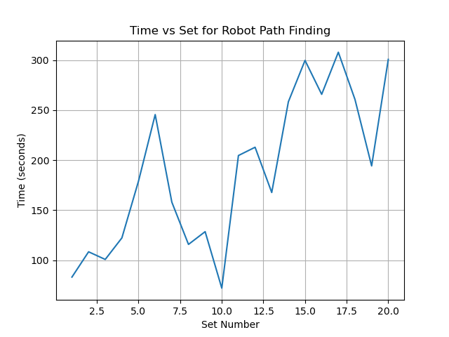
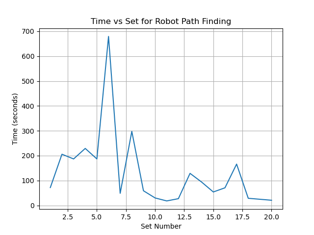

# Adaptive Robot Path Planning in Dynamic Environments using Reinforcement Learning

## Overview
This project implements a **Deep Q-Learning (DQN)** model for adaptive robot path planning in dynamic grid-based environments. The model is enhanced with **Transformer architecture** and **positional encoding**, enabling improved spatial awareness and decision-making. It incorporates advanced reinforcement learning techniques like **Prioritized Replay Buffer** to optimize training and efficiency.

A **Pygame-based simulation environment** is developed to test the robot's adaptability in dynamic and static obstacles scenarios. The project demonstrates how reinforcement learning can be applied to real-world challenges in navigation and robotics.

---

## Features
- **Deep Q-Learning with Transformer Architecture**:
  - Integrated positional encoding for enhanced spatial representation.
  - Compared performance with and without Transformer models using hyperparameter optimization.

- **Dynamic Environment Simulation**:
  - Designed a grid-based simulation with dynamic and static obstacles using **Pygame**.
  - Includes real-time robot navigation and obstacle interactions.

- **Prioritized Experience Replay**:
  - Implemented a **Prioritized Replay Buffer** to sample high-priority experiences, improving training efficiency.

- **Performance Visualization**:
  - Real-time visualization of robot movements, pathfinding efficiency, and dynamic obstacles.
  - Metrics plotted to analyze performance across multiple training episodes.

- **Hyperparameter Optimization**:
  - Utilized **Optuna** to perform 150 trials for tuning hyperparameters, achieving optimal configurations.

---

## Installation and Setup

1. Clone the repository:
   ```bash
   git clone https://github.com/your-username/robot-path-planning.git
   cd robot-path-planning
   ```

2. Install dependencies:
   ```bash
   pip install -r requirements.txt
   ```

3. Run the simulation:
   ```bash
   python main.py
   ```

---

## How It Works

1. **Reinforcement Learning Model**:
   - The agent learns the optimal path using **Deep Q-Learning** by navigating a grid environment and avoiding obstacles.
   - Rewards and penalties guide the learning process.

2. **Transformer Integration**:
   - A Transformer-based model with positional encoding is used to improve pathfinding efficiency.
   - Compared performance metrics with and without Transformer integration.

3. **Simulation Environment**:
   - Obstacles move dynamically in the environment, and the robot adjusts its path in real-time.
   - The simulation visualizes robot movements and highlights the shortest path to the goal.

4. **Hyperparameter Optimization**:
   - Key parameters like learning rate, gamma, epsilon decay, and Transformer-specific configurations were optimized using **Optuna**.

---

## Results
- **Improved Efficiency**: Transformer-based models demonstrated faster pathfinding and better adaptability.
- **Enhanced Training**: Prioritized Replay Buffer reduced training time by focusing on high-priority experiences.
- **Visual Analysis**: Performance metrics and visualizations validated the effectiveness of the reinforcement learning approach.

---

## Future Work
- Implement advanced reinforcement learning algorithms like **Double DQN, Dueling DQN, and PPO**.
- Extend to **multi-agent systems** and **real-world robotics** integration.
- Add **visual perception** capabilities using deep learning for obstacle detection.

---

## Technologies Used
- **Python**: Core programming language.
- **PyTorch**: Framework for building and training neural networks.
- **Pygame**: Simulation environment.
- **Optuna**: Hyperparameter optimization.
- **Matplotlib**: Visualization of performance metrics.

---

## Screenshots
### Without Transformer


### With Transformer


---

## Contributors
- **Raj Sundaram**
- **Aman Patel**
- **Arpit Verma**
- **Priyanshu Chhabda**

*BTech in Computer Science Engineering, IIIT Nagpur*

---

## License
This project is licensed under the MIT License. See the `LICENSE` file for details.
